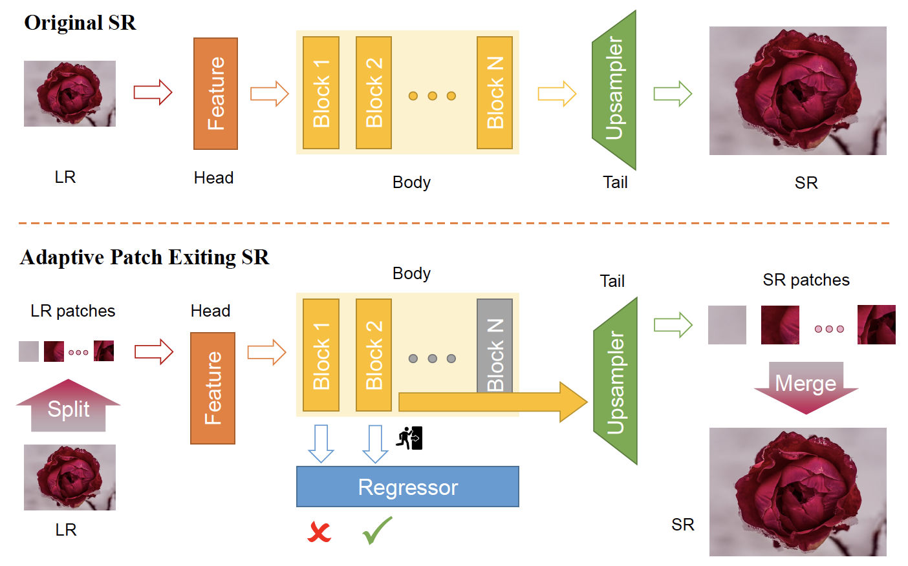

# Adaptive Patch Exiting for Scalable Single Image Super-Resolution (ECCV2022 Oral)

This repository is an official PyTorch implementation of the paper **"Adaptive Patch Exiting for Scalable Single Image Super-Resolution" (ECCV2022 Oral)**.

## Abstract
Since the future of computing is heterogeneous, scalability is a crucial problem for single image super-resolution. Recent works try to train one network, which can be deployed on platforms with different capacities. However, they rely on the pixel-wise sparse convolution, which is not hardware-friendly and achieves limited practical speedup. As image can be divided into patches, which have various restoration difficulties, we present a scalable method based on Adaptive Patch Exiting (APE) to achieve more practical speedup. Specifically, we propose to train a regressor to predict the incremental capacity of each layer for the patch. Once the incremental capacity is below the threshold, the patch can exit at the specific layer. Our method can easily adjust the trade-off between performance and efficiency by changing the threshold of incremental capacity. Furthermore, we propose a novel strategy to enable the network training of our method. We conduct extensive experiments across various backbones, datasets and scaling factors to demonstrate the advantages of our method.



## Dependencies
* PyTorch >= 1.0.0
* numpy
* skimage
* imageio
* matplotlib
* tqdm
* cv2

## Datasets

We used [DIV2K](http://www.vision.ee.ethz.ch/%7Etimofter/publications/Agustsson-CVPRW-2017.pdf) dataset to train our models. You can download it from [here](https://cv.snu.ac.kr/research/EDSR/DIV2K.tar) (7.1GB).

And evaluate our models on HD scenario (DIV2K 0801-0900) and UHD scenario ([DIV8K](https://competitions.codalab.org/competitions/22217#participate) 1401-1500).


## Running the code

There are lots of template in `template.py`, run them by command:
```python
python main.py --template xxx
```
And the args explaination is in the `options.py`.
Here we give some instructions of args:

* For normal training,
`args.data_train` and `args.data_test` are set to `DIV2K` by default.

* For APE traning,
`args.APE` is activated, and every `args.exit_interval` layers will be set as an exit.

* For testing,
`args.test_only` can be set true, and if GPU memory is not enough, `args.chop` can be activated for memory-efficient forwarding. During testing, `args.exit_interval` should be set as same as it in trained model, and `args.exit_threshold` can be set to control the computation (e.g. 1 is max).

Take EDSR for example:

### Traning
Train EDSR:
```python
python main.py --template EDSR
```
Train EDSR-APE:
```python
python main.py --template EDSR_APE
```

### Testing
Test EDSR:
```python
python main.py --template EDSR_test
```

Test EDSR-APE:
```python
python main.py --template EDSR_APE_test
```

